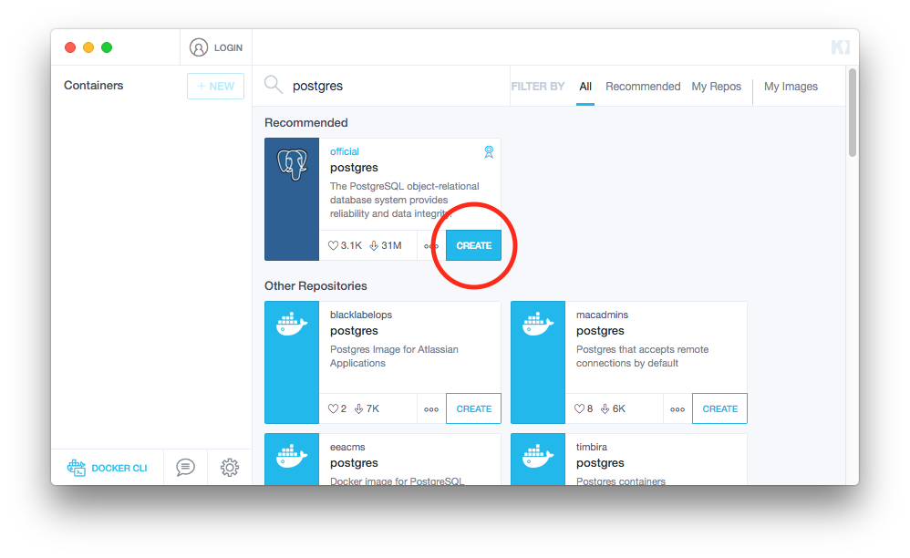
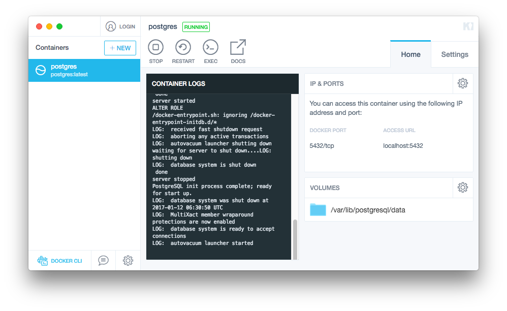
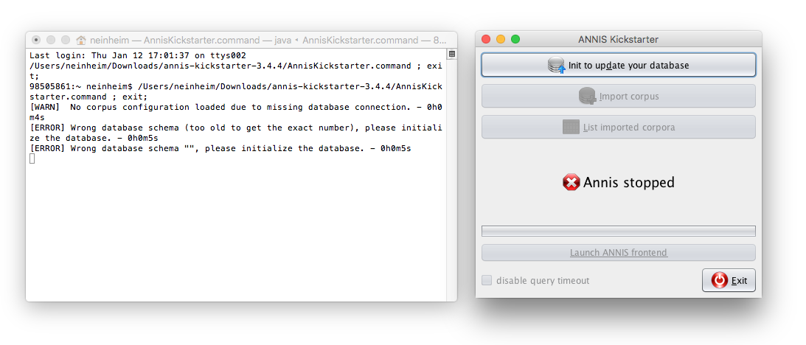
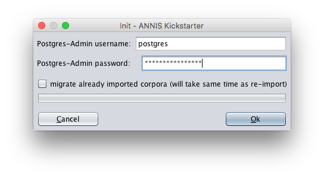
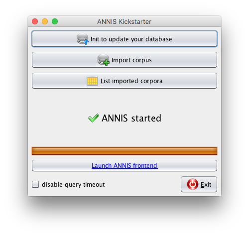
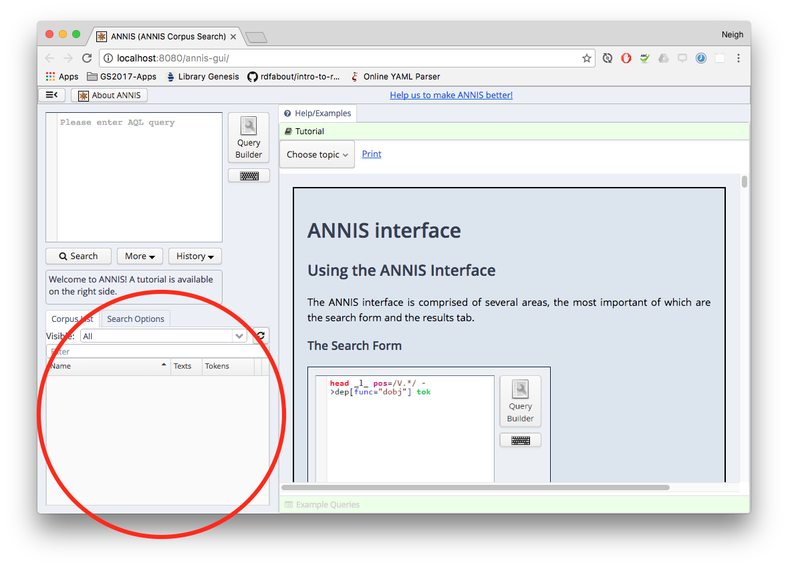
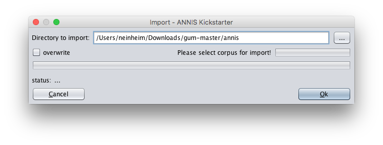
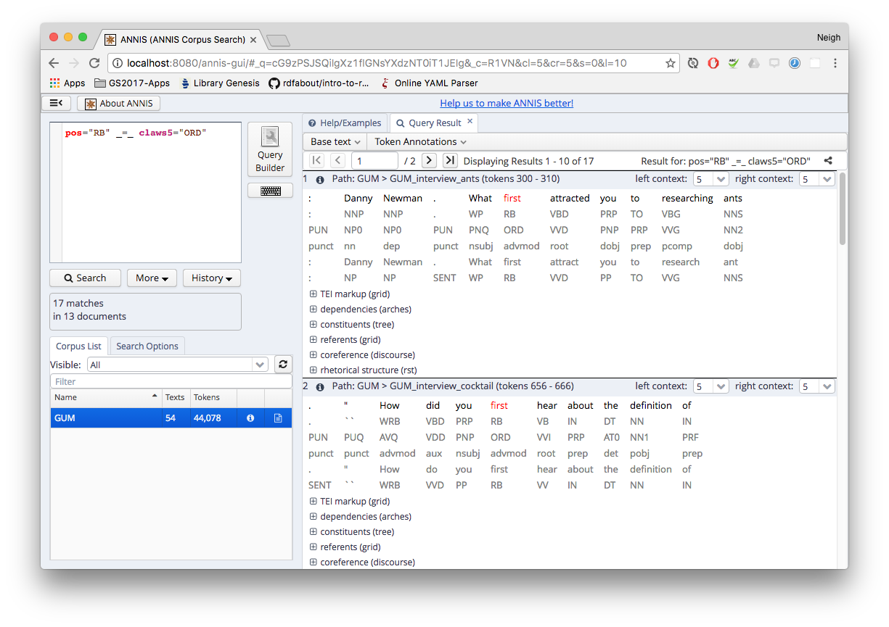

# ANNIS-kickstarter

12 Jan 2017

I'm running `annis-kickstarter-3.4.4` on my Macbook Pro machine. It's very easy to set up, as the documentation suggested it was.

The next step will be to see whether the server version is as easy to install (and Dockerize for deployment).

## Recipe

### 1. Launch a Postgres instance

I'm using Docker Kitematic to launch my Postgres instance:

### 2. Run `AnnisKickstarter.command` (for OS X)

Running `AnnisKickstarter.command` in the root folder of annis-kickstarter launches the ANNIS Kickstarter app, along with an accompanying Terminal window.

The status shows Annis stopped, since the database hasn't been configured yet.

### 3. Initialise ANNIS

Press the `Init to update your database` button, and enter the Postgres details. The default password for the official Postgres container on the Docker container is `mysecretpassword`.

Following the initialisation, the ANNIS status will now show as started.

If the web UI or 'ANNIS frontend' is launched, we can see that it is working but there are no corpora in the database.

### 4. Import a corpus (e.g. GUM)

I'm importing the Georgetown University Multilayer Corpus (GUM), available at [https://github.com/amir-zeldes/gum](https://github.com/amir-zeldes/gum). Clone or download the data and give your local ANNIS instance the path to the `/annis` directory (for me it's `~/Downloads/gum-master/annis`).

After the import (takes about 3 minutes for GUM), we can see that the corpus is now available for searching via the ANNIS frontend:

